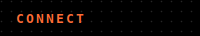
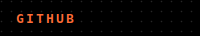

  

 

  &nbsp;
  &nbsp;
  &nbsp;
  

 

- building fast, clean backends that just work
- real-time systems with websockets and message queues
- plugging AI / LLMs into real products
- system design and distributed architecture

 

 

**backend**
`node.js` `express` `python` `flask` `graphql` `socket.io`

**frontend**
`react` `next.js` `typescript` `javascript` `tailwindcss` `redux` `html` `css`

**databases**
`postgresql` `mongodb` `mysql` `redis` `sqlite`

**devops & cloud**
`aws` `docker` `nginx` `linux` `vercel` `cloudflare` `bash`

**ai / ml**
`langchain` `google genai` `prompt engineering`

**tools**
`postman` `figma` `git`

       

  
  

  
  

 

---

